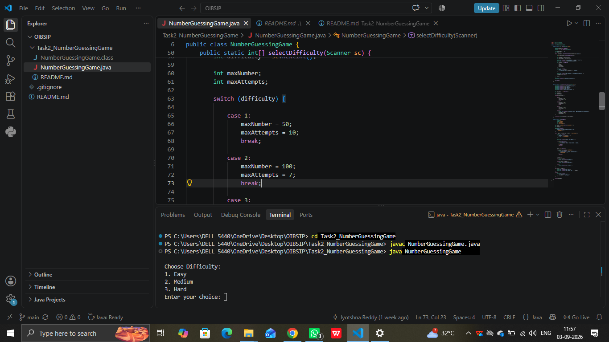
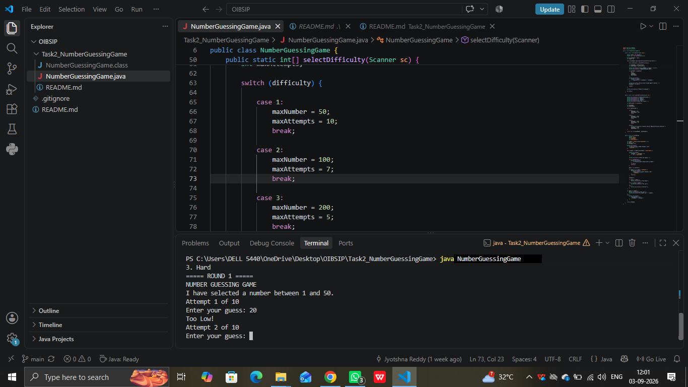
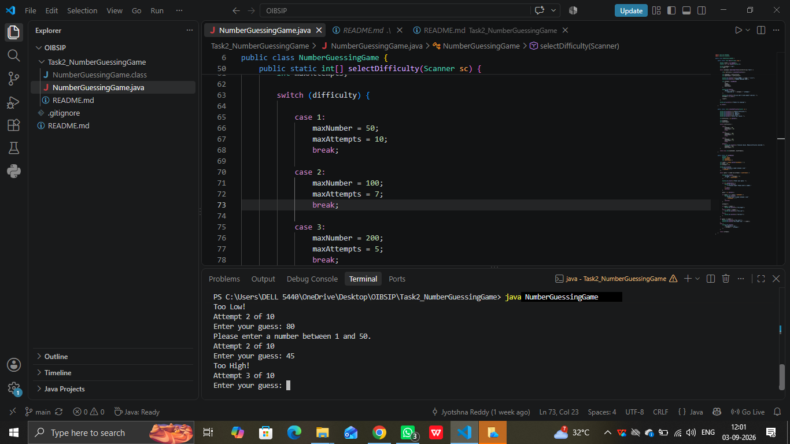
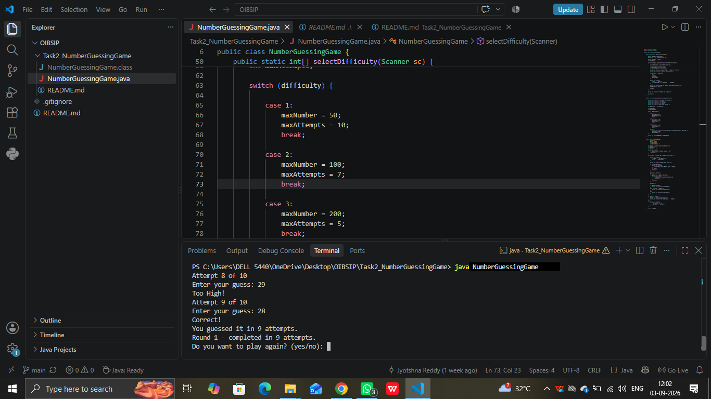
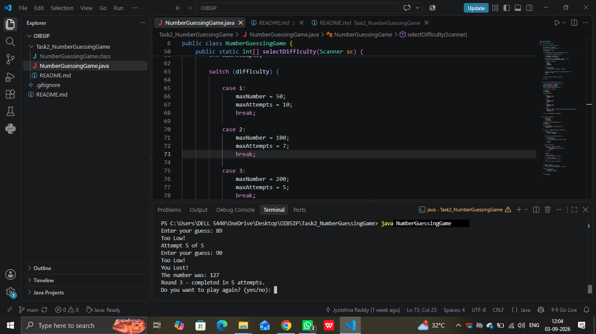
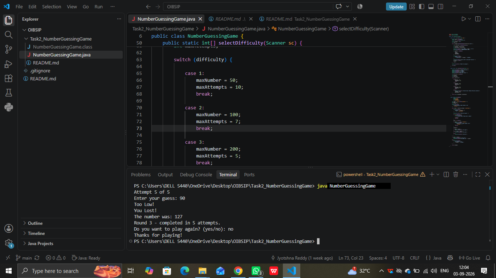

# Number Guessing Game

## Overview

This project is a console-based Number Guessing Game developed using Java as part of the Oasis Infobyte Internship.

The computer generates a random number based on the selected difficulty level, and the user tries to guess the number within a limited number of attempts. The program provides hints such as Too High, Too Low, or Correct after each valid guess.

## Features

- Random number generation
- User input using Scanner
- Too High, Too Low and Correct hints
- Attempt counter
- Maximum attempt limit
- You Lost message with the correct number
- Play Again option
- Multiple round support
- Round tracking
- Input validation
- Three difficulty levels

## Difficulty Levels

| Difficulty | Range | Maximum Attempts |
|------------|-------|------------------|
| Easy | 1 - 50 | 10 |
| Medium | 1 - 100 | 7 |
| Hard | 1 - 200 | 5 |

## Technologies Used

- Java
- VS Code
- Git
- GitHub

## Java Concepts Used

- Variables and data types
- Scanner
- Random
- if-else statements
- while loops
- switch-case
- Methods
- Arrays
- Input validation

## How to Run

1. Open the project in VS Code.
2. Open the terminal.
3. Navigate to the project folder.
4. Compile the program:

```bash
javac NumberGuessingGame.java
## Screenshots

### Options Selection


### Too Low


### Too High


### Correct Guess


### You Lost


### Thanks for Playing
